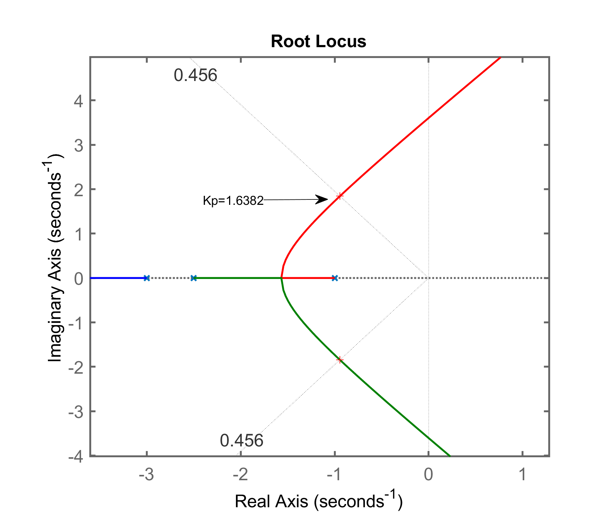
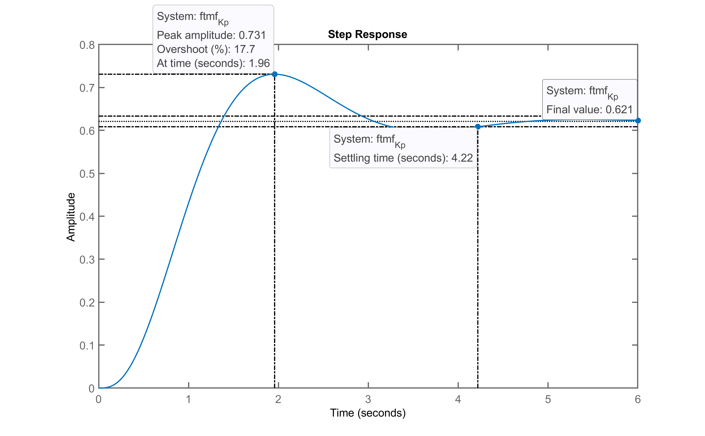
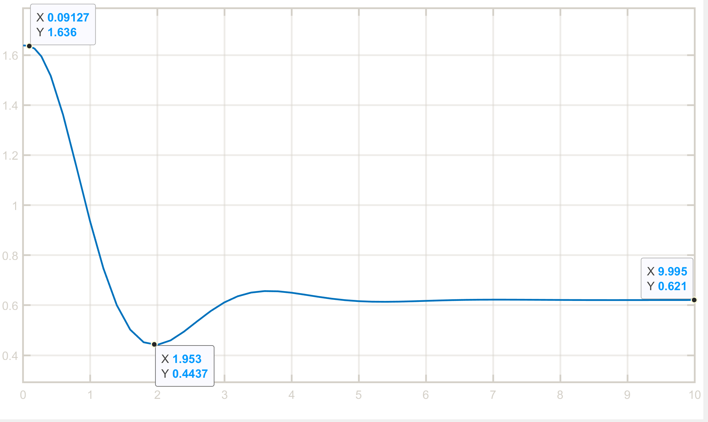
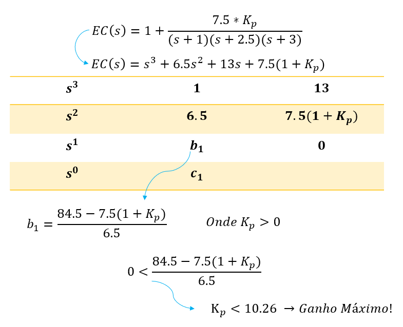
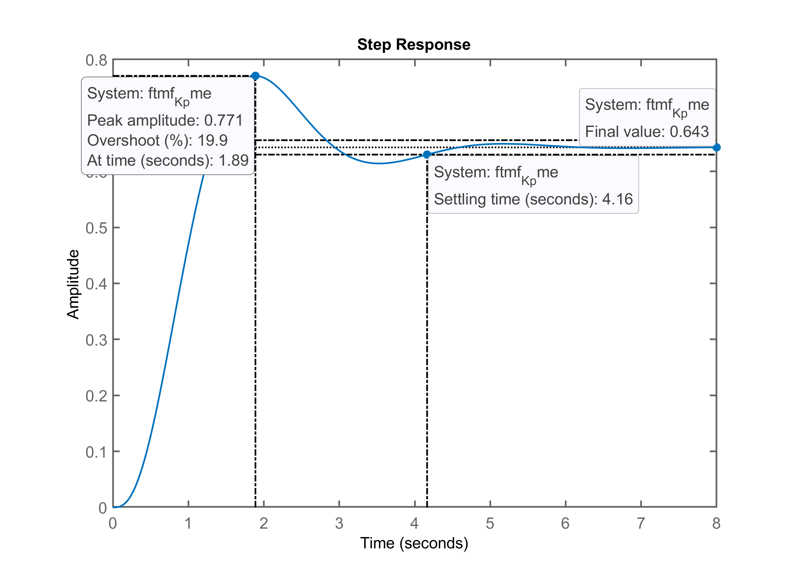

# 
 TRABALHO I 

 Engenharia Elétrica
Data de entrega: 27/06/2020 

 Larissa Brandão Pasinato (115149) 
Henrique Danelli (166455)
 

#### Identificação da planta
O processo a ser controlado é:
$$
G_1(s)=\dfrac{7.5}{(s+1)(s+2.5)(s+3)}
$$

#### Requisitos de controle

Requisitos|	Valores
:--------- | :------:
Amplitude degrau: | 1.0
Sobressinal máximo desejado, ou $\%OS_d:$| 20%
Erro máximo desejado, ou $$$e(\infty)_d:$$$| 10%
Tempo de assentamento máximo desejado, ou $t_s:$| 2.7
Sinal máximo de controle, ou $u(t)_\max:$| 2.0
Sinal mínimo de controle, ou $u(t)_\min$|0

####  ++Tipo de Controlador: Controlador Proporcional++

- #####Equação do controlador:
$$
C(s)=\dfrac{U(s)}{E(s)}=K_p
$$
Onde $K_p$ é o ganho proporcional.

- #####Objetivos esperados:

O controlador proprocional é, basicamente, um amplificador com ganho ajustável. Ao implementá-lo, espera-se que haja uma resposta proporcional ao erro do sistema, juntamente com um valor de erro em regime permanente não nulo. Além disso, é esperado que, para altos valores de $K_p$, o sitema se torne instável.

- #####Comentários iniciais: 

Como na equação do controlador não há zeros ou polos a serem calculados, o ganho $K_p$ será definido pela intersecção da linha-guia estabelecida por zeta ($\zeta$), conforme equação abaixo:
$$
\zeta=\dfrac{-ln(\%OS/100)}{\sqrt{\pi^2+ln^2 (\%OS/100)} }=  0.4559
$$
Isso garante que o sistema não ultrapassará o valor de sobressinal máximo desejado ($\%OS_d= 20$).
Para definir o ganho $K_p$, utilizou-se o gráfico do diagrama root locus gerado via MATLAB, a partir da função **rlocfind(G)**. O valor foi arbitrado a partir do posicionamento do cursor entre o diagrama de root locus e a linha-guia zeta, conforme mostra a Figura 1 abaixo.

- #####Gráfico do Root Locus (RL):
||
| :--- |
| Figura 1: Root Locus do sistema incluindo a ação de controle proporcional, indicando o valor do ganho **K~p~**.|
No qual os polos em malha fechada localizam-se em:
$$
  [-4.6113 + 0.0000i]~~~
  [-0.9443 + 1.8436i]~~~
  [-0.9443 - 1.8436i]
$$
- #####Gráfico da resposta do sistema, y(t):
||
| :--- |
| Figura 2: Resposta ao sistema para um degrau unitário aplicado à malha-fechada.|

- #####Gráfico de u(t):
||
| :--- |
| Figura 3: Gráfico da ação de controle proporcional, com os valores máximos e mínimos indicados.|

- #####Resultados:
Requisitos|	Valores
:--------- | :------:
Amplitude degrau: | 1.0
Sobressinal máximo desejado, ou $\%OS_d:$| 17.7%
Tempo de pico, $t_p:$| 1.96
Tempo de assentamento, $t_s:$| 4.22
Regime permanente na saída da planta, $y(t):$|0.621
Erro em regime permanente, $$$e(\infty)_d:$$$| 37.9%
Sinal máximo de controle, ou $u(t)_\max:$| 1.636
Sinal mínimo de controle, ou $u(t)_\min$|0.4437

- #####Comentários finais:

Ao final do projeto, pode-se perceber que, ao aplicar a ação de controle proporcional, a resposta do sistema ao degrau, apesar de condizente com a teoria, mostrou-se insuficiente. O erro em regime permanente não nulo ultrapassou o requisito de controle desejado, bem como o tempo de assentamento. Além disso, os valores máximos e mínimos do sinal de controle, apesar de não terem desenvolvido amplitudes excessivas, não correspondem ao requisitado. Para tanto, vê-se a necessidade da integração de outros controladores juntamente com a ação proporcional para que os requisitos sejam cumpridos.
- #####Melhorias:

Uma alternativa de melhora para o sistema, no caso da ação proporcional, seria aumentar levemente o ganho de $K_p$, com a cautela de não ultrapassar o valor de $$$OS_d$$$ e de não saturar a ação de controle. Para tanto, inicialmente calculou-se o valor máximo de ganho possível a partir do diagrama de Routh-Hurwitz, conforme mostrado na Figura 4 abaixo.

||
| :--- |
| Figura 4: Diagrama de Routh-Hurwitz para o controlador proposto.|
Ao realizar a simulação do controlador, verificou-se que a resposta do sistema ao degrau, quando aplicado o ganho máximo, torna-se marginalmente estável. Para tanto, decidiu-se manter o valor de $K_p$ abaixo de 10.26 e, ao realizar alguns testes via MATLAB, percebeu-se que, para manter a resposta do sistema dentro das especificações (nesse caso, $$$\%OS_d=20%$$$), o valor máximo de ganho ajustado deveria ser de $$$K_p=1.8$$$, exemplificado na Figura 5:

||
| :--- |
| Figura 5: Resposta do sistema ao degrau, com o valor do ganho proporcional refinado.|
Com isso, apesar de ainda não corresponder aos requisitos iniciais, houve uma leve melhora tanto no tempo de assentamento, quanto na diminuição do erro.