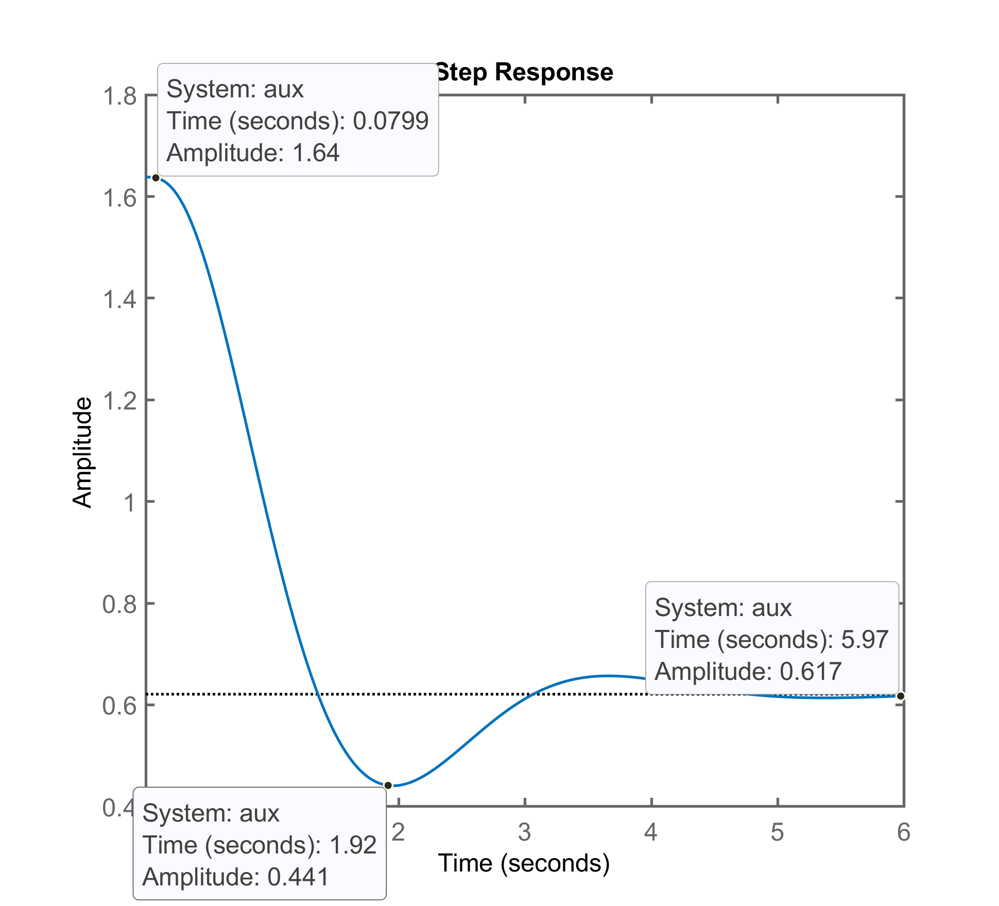
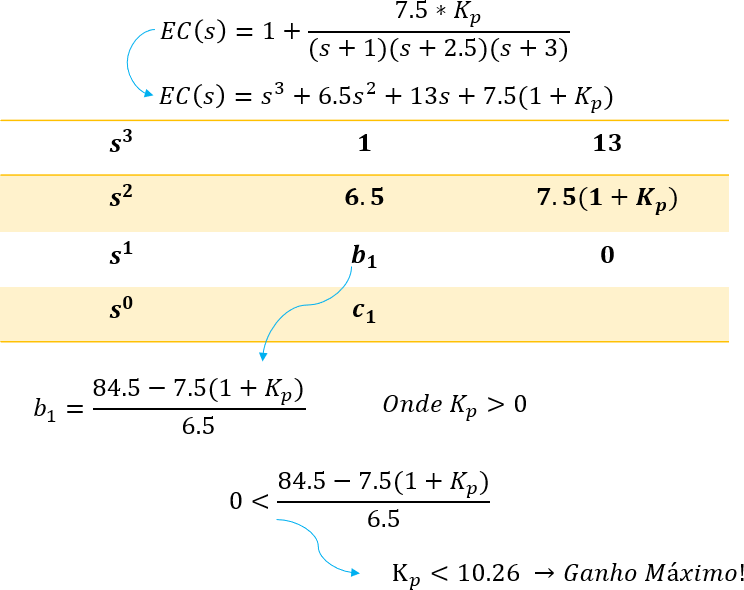

# 
 TRABALHO I 

 Engenharia Elétrica
Data de entrega: 27/06/2020 

 Larissa Brandão Pasinato (115149) 
Henrique Danelli (166455)
 

#### Identificação da planta
O processo a ser controlado é:
$$
G_1(s)=\dfrac{7.5}{(s+1)(s+2.5)(s+3)}
$$

#### Requisitos de controle

Requisitos|	Valores
:--------- | :------:
Amplitude degrau: | 1.0
Sobressinal máximo desejado, ou $\%OS_d:$| 20%
Erro máximo desejado, ou $$$e(\infty)_d:$$$| 10%
Tempo de assentamento máximo desejado, ou $t_s:$| 2.7
Sinal máximo de controle, ou $u(t)_\max:$| 2.0
Sinal mínimo de controle, ou $u(t)_\min$|0

####  ++Controlador Proporcional++

- #####Equação do controlador:
$$
C(s)=\dfrac{U(s)}{E(s)}=K_p
$$
Onde $K_p$ é o ganho proporcional.

- #####Objetivos esperados:

O controlador proprocional é, basicamente, um amplificador com ganho ajustável. Ao implementá-lo, espera-se que haja uma resposta proporcional ao erro do sistema, juntamente com um valor de erro em regime permanente não nulo. Além disso, é esperado que, para altos valores de $K_p$, o sitema se torne instável.

- #####Comentários iniciais: 

Como na equação do controlador não há zeros ou polos a serem calculados, o ganho $K_p$ será definido pela intersecção da linha-guia estabelecida por zeta ($\zeta$), conforme equação abaixo:
$$
\zeta=\dfrac{-ln(\%OS/100)}{\sqrt{\pi^2+ln^2 (\%OS/100)} }=  0.4559
$$
Isso garante que o sistema não ultrapassará o valor de sobressinal máximo desejado ($\%OS_d= 20$).

Para definir o ganho $K_p$, utilizou-se o gráfico do diagrama root locus gerado via MATLAB, a partir da função **rlocfind(G)**. O valor foi arbitrado a partir do posicionamento do cursor entre o diagrama de root locus e a linha-guia zeta, conforme mostra a Figura 1 abaixo.

- #####Gráfico do Root Locus (RL):

||
| :--- |
| Figura 1: Root Locus do sistema incluindo a ação de controle proporcional, indicando o valor do ganho $K_p$.|

No qual os polos em malha fechada localizam-se em:
$$
  [-4.6113 + 0.0000i]~~~

  [-0.9443 + 1.8436i]~~~

  [-0.9443 - 1.8436i]
$$

- #####Gráfico da resposta do sistema, y(t):

||
| :--- |
| Figura 2: Resposta ao sistema para um degrau unitário aplicado à malha fechada.|

- #####Gráfico de u(t):

||
| :--- |
| Figura 3: Gráfico da ação de controle proporcional, com os valores máximos e mínimos indicados.|

- #####Resultados:

Requisitos|	Valores
:--------- | :------:
Amplitude degrau: | 1.0
Sobressinal máximo desejado, ou $\%OS_d:$| 17.7%
Tempo de pico, $t_p:$| 1.96
Tempo de assentamento, $t_s:$| 4.22
Regime permanente na saída da planta, $y(t):$|0.621
Erro em regime permanente, $$$e(\infty)_d:$$$| 37.9%
Sinal máximo de controle, ou $u(t)_\max:$| 1.636
Sinal mínimo de controle, ou $u(t)_\min$|0.4437

- #####Comentários finais:

Ao final do projeto, pode-se perceber que, ao aplicar a ação de controle proporcional, a resposta do sistema ao degrau, apesar de condizente com a teoria, mostrou-se insuficiente. O erro em regime permanente não nulo ultrapassou o requisito de controle desejado, bem como o tempo de assentamento. Além disso, os valores máximos e mínimos do sinal de controle, apesar de não terem desenvolvido amplitudes excessivas, não correspondem aos limites requisitados. Para tanto, vê-se a necessidade da integração de outros controladores juntamente com a ação proporcional para que os requisitos sejam cumpridos.

- #####Melhorias:

Uma alternativa de melhora para o sistema, no caso da ação proporcional, seria aumentar levemente o ganho de $K_p$, com a cautela de não ultrapassar o valor de $$$OS_d$$$ e de não saturar a ação de controle. Para tanto, inicialmente calculou-se o valor máximo de ganho possível a partir do diagrama de Routh-Hurwitz, conforme mostrado na Figura 4 abaixo.

||
| :--- |
| Figura 4: Diagrama de Routh-Hurwitz para o controlador proposto.|

Ao realizar a simulação do controlador, verificou-se que a resposta do sistema ao degrau, quando aplicado o ganho máximo, torna-se marginalmente estável. Portanto, manteve-se o valor de $K_p$ abaixo de 10.26 e, ao realizar alguns testes via MATLAB, foi possível perceber que, para manter a resposta do sistema dentro das especificações (nesse caso, $\%OS_d=20%$), o valor máximo de ganho ajustado deveria ser de $$$K_p=1.8$$$, exemplificado na Figura 5:

||
| :--- |
| Figura 5: Resposta do sistema ao degrau, com o valor do ganho proporcional refinado.|

Com isso, apesar de ainda não corresponder aos requisitos iniciais, houve uma leve melhora tanto no tempo de assentamento, quanto na diminuição do erro.

#### ++Controlador Integrador Puro++
- #####Equaçao do controlador:

$$
C(s)=\dfrac{K_i}{s}
$$
Onde $K_i$ é o ganho do integrador puro.

- #####Objetivos esperados:

Por possuir um polo na origem e, com isso, tornar-se um sistema do tipo 1, ao responder ao degrau unitário, tal sistema apresente erro nulo em regime permanente. Entretanto, espera-se tamgbém um aumento no tempo de assentamento.

- #####Comentários Iniciais:

O erro em regime permanente para o caso dá-se pela relação matemática $e(\infty)=\dfrac{1}{1+\lim_{s \to 0}K/s}$, que, quando aplicado um degrau na entrada do sistema, resulta em $e(\infty)=\dfrac{1}{1+\infty}=0$. Ainda, a elevação do tempo de assentamento é ocasionada pelo polo extra na origem, o qual responderá ao degrau juntamente com o restante dos polos da planta e, portanto, atrasará o sistema. Para observar como o sistema reagirá à ação de controle, analisaremos o root locus e, posteriormente, a resposta ao degrau.

- #####Gráfico do Root Locus (RL):

||
| :--- |
| Figura 6: Diagrama de RL do sistema incluindo a ação integral pura e o ganho $K_i$.|
No qual os polos de malha fechada localizam-se em:
$$
[-2.9620 + 0.6667i]~~~
  [-2.9620 - 0.6667i]~~~
  [-0.2880 + 0.5355i]~~~
  [-0.2880 - 0.5355i]
$$
- #####Gráfico da resposta do sistema, y(t):
||
| :--- |
| Figura 7: Resposta ao sistema para um degrau unitário aplicado à malha fechada.|

- #####Gráfico da ação de controle, u(t):
||
| :--- |
| Figura 8: Ação de controle integral, com o valor máximo indicado (o valor mínimo, nesse caso, é zero).|
- #####Resultados:
Requisitos|	Valores
:--------- | :------:
Amplitude degrau: | 1.0
Sobressinal máximo desejado, ou $\%OS_d:$| 17.7%
Tempo de pico, $t_p:$| 6.56
Tempo de assentamento, $t_s:$| 14.2
Regime permanente na saída da planta, $y(t):$| 1
Erro em regime permanente, $$$e(\infty)_d:$$$| 0
Sinal máximo de controle, ou $u(t)_\max:$| 1.24
Sinal mínimo de controle, ou $u(t)_\min$|0

- #####Comentários finais:

Ao observar os gráficos mostrados anteriormente, pode-se comprovar o aumento expressivo do tempo de assentamento da resposta do sistema, valor que extrapola o limite imposto como requisito de controle. Além disso, houve o erro nulo em regime permanente, e os valores máximos e mínimos da ação de controle não apresentaram valores significativamente divergentes do solicitado. Como a tentativa de melhoria ao aumentar o ganho $K_i$ não apresentou resultados significativos (o tempo de assentamento seguiu elevado sem que o máximo $\%OS_d$ fosse ultrapassado), conclui-se que não há um método eficaz utlizando apenas o controlador integral visando a adequação do sistema aos requisitos de controle.

#### ++Controlador Proporcional+Integrativo (PI)++
- #####Equação do controlador:

$$
C(s)=K_p+\dfrac{K_i}{s}=\dfrac{K_p(s+\dfrac{K_i}{K_p})}{s}=\dfrac{K\cdot(s+z_1)}{s}
$$
Na qual $K$ é o ganho da ação PI.

- #####Objetivos esperados:

Em razão dessa ação de controle ser a soma das ações proporcional e integrativa puras, espera-se que os efeitos negativos de cada um sejam minimizados - nesse caso, o tempo de assentamento prolongado e o erro em regime permanente não nulo.

- #####Comentários iniciais:

Quando os gráficos dos controladores proporcional e integrativo são comparados, é possível perceber a nítida diferença quando se trata dos valores de $t_s$ e do erro $e(\infty)$. Dessa forma, é importante destacar que o zero localizado na equação do controlador fará com que o tempo de assentamento corresponda aos requisitos solicitados, assim como o polo $s$ na origem resultará na formação de sistema tipo 1 e, portanto, apresentará erro em regime permanente nulo. O valor calculado para o zero do controlador será feito utilizando o método da contribuição angular, seguindo a definição:
$$
\sum_m ∠(s-z_i)+\sum_n∠(s-p_j)=±180°(2k+1),~~~~~k=0,1,2…
$$
Faz-se aqui um comentário extra quanto à forma de encontrar o local do zero. Uma vez encontrado o ângulo desejado (via fórmula acima), é possível encontrar o valor da posição real do zero, $\sigma_z$, a partir das relações:
$$
\sum_m ∠(s-z_i)=\pi+\sum_n∠(s-p_j)
$$
$$
\delta_x = \dfrac{\omega_d}{tan(\sum ∠(s-z_i))}
$$
$$
\sigma_z=(-\sigma)-\delta_x
$$